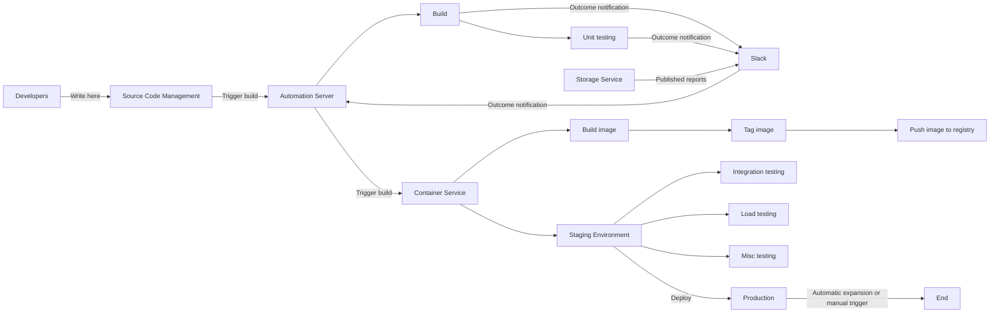

```mermaid

flowchart LR
    Developers -->|Write here| SourceCode[Source Code Management]
    SourceCode -->|Trigger build| Automation[Automation Server]
    Automation -->|Trigger build| Container[Container Service]
    Automation --> Build
    Build -->|Outcome notification| Slack
    Build --> UnitTesting[Unit testing]
    UnitTesting -->|Outcome notification| Slack
    Container --> BuildImage[Build image]
    BuildImage --> TagImage[Tag image]
    TagImage --> PushRegistry[Push image to registry]
    Container --> Staging[Staging Environment]
    Staging --> IntegrationTesting[Integration testing]
    Staging --> LoadTesting[Load testing]
    Staging --> MiscTesting[Misc testing]
    Staging -->|Deploy| Production
    Production -->|Automatic expansion or manual trigger| ProdEnd[End]

    Storage[Storage Service] -->|Published reports| Slack
    Slack -->|Outcome notification| Automation
```
